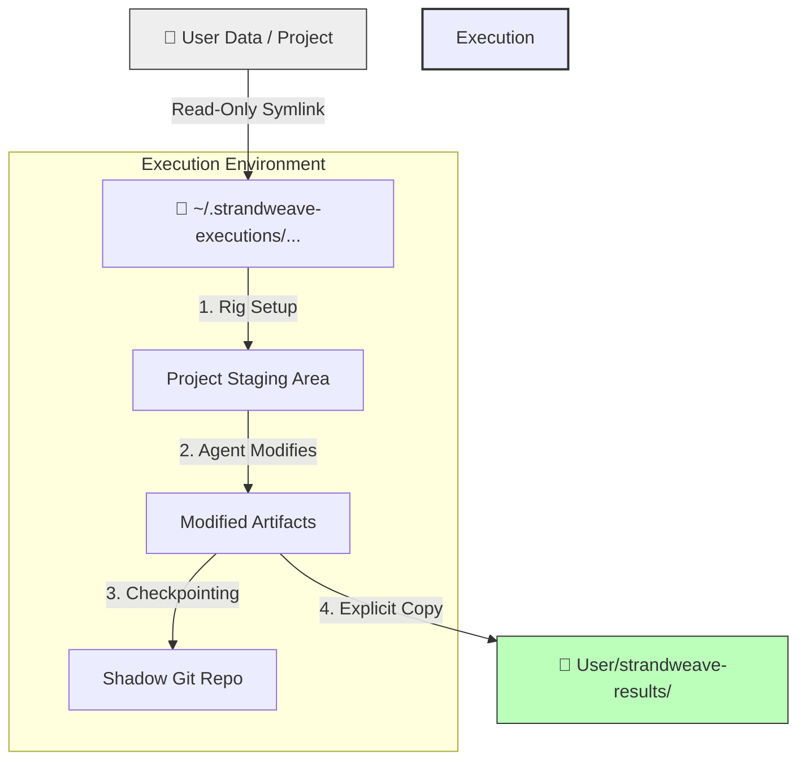

# Strandweave Runner

Strandweave Runner is an orchestration runtime for **Antibrittle Agentic Workflows**.

It is designed to transform the stochastic, unpredictable nature of LLM coding agents into a reliable, engineering-grade process. Instead of relying on a single, monolithic chat session to solve complex problems, Strandweave breaks workflows down into atomic units called **Codons**, executes them in complete isolation, and stitches them together into **Strands**.

This is not just a wrapper for Claude; it is a stateful runtime environment that provides time-travel (rollbacks), observability (sentinels), and rigorous execution boundaries.

---

## Table of Contents

1. [Core Concepts](#core-concepts)
2. [The Execution Model (Crucial)](#the-execution-model)
3. [Why Strandweave?](#why-strandweave)
4. [Installation](#installation)
5. [Getting Started](#getting-started)
6. [Advanced Features: Sentinels & Loops](#advanced-features)
7. [Debugging & Internals](#debugging--internals)
8. [Use Cases & Failure Modes](#use-cases--failure-modes)

---

## Core Concepts

To use Strandweave effectively, you must understand its primitives. We move away from "chatting" with an agent to "programming" an agent's lifecycle.

### 1. The Codon
A **Codon** is the atomic unit of work. It represents a single phase of a larger task. A Codon has:
*   **A Goal**: Defined by a specific prompt file or text.
*   **A Boundary**: A specific set of files it is allowed to track and modify.
*   **A Model**: Specific capability selection (e.g., `sonnet` for speed, `opus` for reasoning).
*   **A Context Strategy**: It can either start `fresh` (clean slate) or `continue-previous` (inherit the previous codon's conversation history).

### 2. The Strand
A **Strand** is the sequence of Codons defined in a `strand.json` file. It represents the "DNA" of your workflow.

### 3. The Run
A **Run** is a specific instance of executing a Strand against a dataset. Runs are persistent objects stored on disk. If a run crashes or is stopped, it can be resumed, inspected, or rolled back.

---

## The Execution Model

**⚠️ IMPORTANT:** Strandweave does **NOT** run directly inside your project folder.

To achieve reliability and clean rollbacks, Strandweave uses **Execution Isolation**. When you point Strandweave at a dataset (your project), it does not modify that data in place.

### How Data Flows



1.  **Isolation**: Strandweave creates a unique directory in `~/.strandweave-executions/`.
2.  **Mounting**: It mounts your source data into `read_only_data_source/` inside that execution directory.
3.  **Execution**: The agent works entirely inside this temporary execution folder. It creates files, runs code, and makes mistakes *there*, not in your source repo.
4.  **Output**: You must explicitly configure `outputFiles` in your codon config to copy successful artifacts back to a `strandweave-results/` folder in your working directory.

This ensures that if an agent hallucinates and deletes your codebase, it has only deleted a temporary copy.

---

## Why Strandweave?

Large Language Models suffer from context degradation. As a conversation gets longer, the model gets "dumber," "lazier," and more prone to hallucination. Strandweave solves this through **Phased Execution**.

### 1. Fresh Context Windows
By breaking a task into Codons, you can reset the context window when necessary.
*   *Codon 1 (Research)*: Reads 50 files, fills context. Outputs a summary.
*   *Codon 2 (Architect)*: Starts `fresh`, reads only the summary. Full intelligence available for planning.

### 2. The "Save Game" System (Shadow Git)
Strandweave maintains a hidden Git repository inside the execution directory.
*   Every time a Codon completes, a commit is made.
*   If the agent goes down a rabbit hole, you can **Rollback** to the previous Codon.
*   This allows you to branch reality: try Codon B, fail, rollback, try Codon B (revised).

### 3. Sentinels (Parallel Observation)
While the main agent works, **Sentinels** run in parallel. These are non-blocking observers that watch the event stream.
*   *Documentation Sentinel*: Writes a `CHANGELOG` while the agent codes.
*   *Security Sentinel*: Watches for dangerous bash commands.
*   *Cost Sentinel*: Alerts if token usage spikes.

---

## Installation

### Prerequisites

1.  **Bun Runtime**: [Install Bun](https://bun.sh).
2.  **Git**: Required for the checkpoint system.
3.  **Claude CLI**: You must install a specific version of the Claude CLI to ensure protocol compatibility.

```bash
npm i -g @anthropic-ai/claude-cli@1.0.44
```

### Setting up Strandweave

Clone the repository and install dependencies:

```bash
git clone https://github.com/your-org/strandweave.git
cd strandweave
bun install
```

### Verify Installation

Run the End-to-End tests to ensure your environment is ready. This will spin up a real server instance and run a test workflow.

```bash
bun test tests/e2e/happy-path-e2e.test.ts
```

---

## Getting Started

To run Strandweave effectively, you should treat it as an external tool acting on your data.

### Quick Start (Recommended)

The fastest way to get started is with the `--init` command:

```bash
# 1. Create and enter a new workspace directory
mkdir my-agent-workflow
cd my-agent-workflow

# 2. Initialize with template files
bun /path/to/strandweave/server/index.ts --init

# 3. Run the workflow on your data
bun /path/to/strandweave/server/index.ts --config=strand.json --data=/path/to/your/project
```

The `--init` command creates:
- **strand.json** - Workflow configuration with a basic analysis codon
- **prompts/analyze.md** - Template prompt for analysis
- **.gitignore** - Ignores execution directories and outputs
- **README.md** - Quick start guide

### Manual Setup

Alternatively, you can create your workflow configuration manually:

#### 1. Prepare Your Workspace

Do not run this inside the Strandweave repo (unless developing it). Create a separate workspace.

```bash
mkdir my-agent-workflow
cd my-agent-workflow
```

#### 2. Create a Strand Configuration

Create a file named `strand.json`. This defines your workflow using the object format:

```json
{
  "meta": {
    "name": "My Workflow",
    "version": "1.0.0",
    "description": "Analyze and refactor codebase"
  },
  "recommendations": {
    "model": "sonnet"
  },
  "strand": [
    {
      "id": "phase-1-analysis",
      "name": "Analyze Codebase",
      "model": "sonnet",
      "continuationMode": "fresh",
      "promptText": "Read the source files in <%DATA_DIR%> and write a summary to analysis.md",
      "trackedFiles": ["analysis.md"],
      "outputFiles": [
        {
          "copy": ["analysis.md"]
        }
      ]
    },
    {
      "id": "phase-2-refactor",
      "name": "Refactor Code",
      "model": "sonnet",
      "continuationMode": "continue-previous",
      "promptText": "Based on your analysis, refactor the code structure.",
      "trackedFiles": ["src/**/*.ts"]
    }
  ]
}
```

#### 3. Run the Server

You need to point the server to two things:
1. `--config`: The strand file you just created
2. `--data`: The target project or file you want to process

**Recommendation**: Use the `--validate` flag first to check your config.

```bash
# From your workspace, referencing the strandweave repo you cloned
bun /path/to/strandweave/server/index.ts --validate --config=./strand.json --data=./my-target-project/
```

If valid, run the server with the **TUI (Terminal UI)**. We also recommend `--start-new` to ensure you aren't resuming an old stale session.

```bash
bun /path/to/strandweave/server/index.ts --basic --start-new --config=./strand.json --data=./my-target-project/
```

### 4. Interactive Controls

Once running in Basic Mode (`--basic`), you are in the **TUI**.

| Key | Action | Description |
| :--- | :--- | :--- |
| `n` | **Next** | Start executing the next Codon in the sequence. |
| `s` | **Skip** | Skip the current Codon (marks it as skipped in history). |
| `f` | **Force Stop** | Immediately kill the agent. Useful if it gets stuck. |
| `l` | **List** | Show available checkpoints. |
| `r` | **Rollback** | Enter the Rollback menu to revert state. |
| `q` | **Quit** | Shutdown the server safely. |

---

## Advanced Features

### Sentinels

Sentinels allow you to extract structured data or monitor the agent without distracting it.

```json
"sentinels": [
  {
    "sentinelConfig": {
      "id": "security-watchdog",
      "trigger": { "type": "event", "on": ["tool.result"] },
      "execution": { "strategy": "immediate" },
      "userPromptText": "Analyze this tool output for security leaks: {{events}}"
    }
  }
]
```

### Loops

Loops allow the agent to iterate until a condition is met. This is useful for TDD (Test Driven Development) cycles.

```json
{
  "type": "loop",
  "id": "tdd-cycle",
  "terminateOn": { "type": "iterationLimit", "limit": 5 },
  "codons": [
    { "id": "write-test", ... },
    { "id": "write-code", ... }
  ]
}
```

**Note on Context Exhaustion**: You can set `terminateOn: { "type": "contextExceeded" }`. The loop will run indefinitely until the model's context window fills up, at which point Strandweave gracefully terminates the loop and moves to the next phase.

---

## Debugging & Internals

If a run fails, or you want to inspect what the agent actually did, look in the execution directory.

The server logs its location on startup:
`Created execution directory: ~/.strandweave-executions/1737123456-abc-d4f5`

Inside that folder:

*   **`read_only_data_source/`**: A symlink to your original data.
*   **`.strandweave/state.json`**: The full state machine history.
*   **`.strandweave/events/events.jsonl`**: A comprehensive journal of every single event (tool use, token count, file change).
*   **`.strandweave/logs/`**: Raw logs from the Claude CLI process.
*   **`.strandweave/checkpoints/`**: The shadow git repository. You can `cd` in here and run `git log` to see the commit history of your agent's work.

---

## Use Cases & Failure Modes

### Ideal Use Cases
1.  **Legacy Migrations**: Reading huge codebases (Codon 1), mapping dependencies (Codon 2), generating new scaffolding (Codon 3).
2.  **Documentation**: A Sentinel running alongside a coding agent can generate documentation in real-time.
3.  **Data Extraction**: Feeding a large PDF into Strandweave and using a Loop to extract structured data page-by-page.

### Common Failure Modes
1.  **Context Exhaustion**: If a Codon runs too long, Claude will stop working.
    *   *Fix*: Use Loops with `contextExceeded` termination or break the Codon into smaller steps.
2.  **Tool Loops**: The agent may get stuck trying to run a failing command (e.g., `npm test` failing repeatedly).
    *   *Fix*: Use the `f` key to Force Stop, then `r` to Rollback and edit the prompt to guide the agent differently.
3.  **Rig Setup Failures**: If `npm install` fails in the execution dir.
    *   *Fix*: Ensure your `rigSetup` commands are valid for the environment Strandweave is running in.
